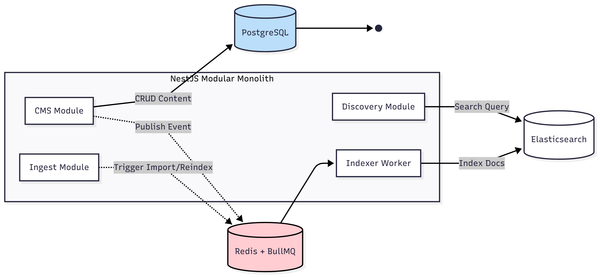
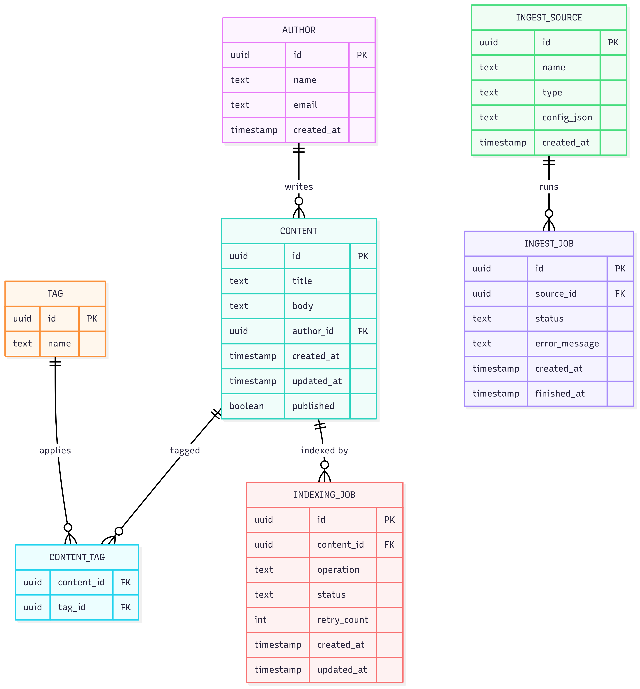
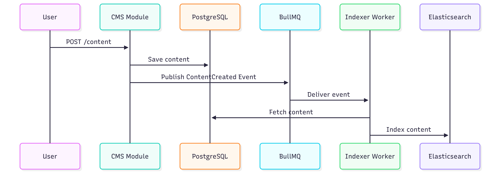
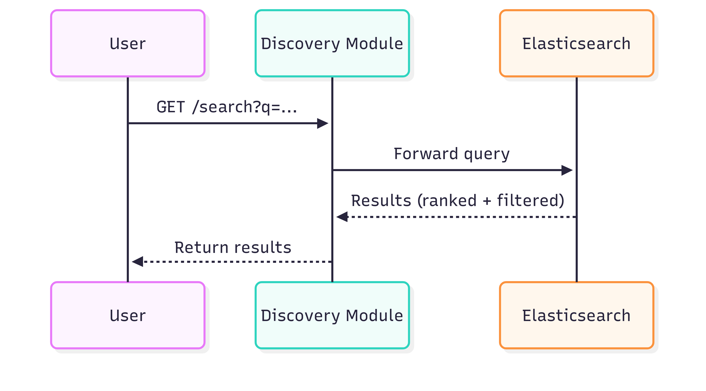
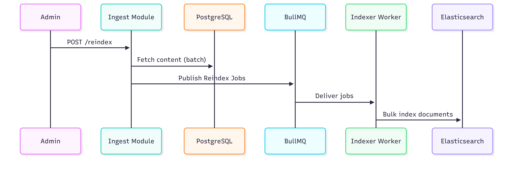

<p align="center">
  <a href="http://nestjs.com/" target="blank"></a>
</p>

# CMS Backend System - Modular Monolith

A robust content management system built with NestJS, featuring a modular monolith architecture that can evolve into microservices.

## 🏗️ System Overview

### Architecture Overview



_High-level architecture showing the modular monolith structure and service interactions_

### Database Schema



_Complete database schema showing all entities and their relationships_

## 🔄 System Flows

### Content Creation Flow



_Sequence diagram showing the complete content creation and indexing process_

### Search Flow



_Sequence diagram showing how search queries are processed through the system_

### Reindex Flow



_Sequence diagram showing the bulk reindexing process for external data sources_

## 🏗️ Architecture Details

- **Modular Monolith**: Well-structured modules that can be extracted into microservices
- **CMS Module**: Content management (CRUD for articles, tags, authors)
- **Discovery Module**: Advanced search and filtering through Elasticsearch
- **Indexing Module**: Asynchronous indexing using BullMQ (Redis)
- **Ingest Module**: Bulk import and reindexing from external sources

## 🚀 Quick Start

### Prerequisites

- Node.js 18+
- Docker + Docker Compose
- Redis (for BullMQ queue)
- Elasticsearch (with Kibana optional)

### 1. Start External Services

```bash
# Start PostgreSQL, Redis, and Elasticsearch
docker-compose -f docker/docker-compose.yml up -d
```

### 2. Install Dependencies

```bash
npm install
```

### 3. Environment Setup

Create a `.env` file with the following variables:

```env
# App
PORT=3000
NODE_ENV=development

# Database (PostgreSQL)
DATABASE_HOST=localhost
DATABASE_PORT=5432
DATABASE_USER=postgres
DATABASE_PASS=postgres
DATABASE_NAME=content_db

# Redis (BullMQ)
REDIS_HOST=localhost
REDIS_PORT=6379

# Elasticsearch
ES_NODE=http://localhost:9200
ES_INDEX=contents
ES_USERNAME=
ES_PASSWORD=
```

### 4. Initialize Elasticsearch Index

```bash
# Create the index with proper mappings
curl -X PUT "http://localhost:9200/contents" -H 'Content-Type: application/json' -d '{
  "mappings": {
    "properties": {
      "id": { "type": "keyword" },
      "title": {
        "type": "text",
        "analyzer": "standard",
        "fields": {
          "keyword": { "type": "keyword", "ignore_above": 256 }
        }
      },
      "body": {
        "type": "text",
        "analyzer": "standard"
      },
      "author": {
        "properties": {
          "id": { "type": "keyword" },
          "name": { "type": "text" }
        }
      },
      "tags": {
        "type": "nested",
        "properties": {
          "id": { "type": "keyword" },
          "name": { "type": "keyword" }
        }
      },
      "created_at": { "type": "date" },
      "updated_at": { "type": "date" },
      "published": { "type": "boolean" }
    }
  }
}'
```

### 5. Run the Application

```bash
# Development mode
npm run start:dev

# Production mode
npm run build
npm run start:prod
```

## 📁 Project Structure

```
src/
├── common/
│   └── config/           # Configuration management
├── database/
│   └── entities/         # Database entities
├── cms/                  # Content Management System
│   ├── entities/         # Content, Author, Tag entities
│   ├── dto/             # Data Transfer Objects
│   ├── cms.controller.ts
│   ├── cms.service.ts
│   └── cms.module.ts
├── discovery/            # Search and Discovery
│   ├── discovery.controller.ts
│   ├── discovery.service.ts
│   └── discovery.module.ts
├── search/               # Elasticsearch integration
│   ├── search.service.ts
│   ├── search.types.ts
│   └── search.module.ts
├── queue/                # BullMQ queue management
│   ├── workers/
│   ├── jobs/
│   └── queue.module.ts
├── ingest/               # Bulk import functionality
│   ├── entities/
│   ├── ingest.controller.ts
│   ├── ingest.service.ts
│   └── ingest.module.ts
└── health/               # Health checks
    ├── health.controller.ts
    ├── health.service.ts
    └── health.module.ts
```

## 🔌 API Endpoints

### CMS Module

#### Content Management

- `POST /cms/content` - Create new content
- `GET /cms/content` - List all content
- `GET /cms/content/:id` - Get content by ID
- `PATCH /cms/content/:id` - Update content
- `DELETE /cms/content/:id` - Delete content

#### Authors

- `POST /cms/authors` - Create author
- `GET /cms/authors` - List all authors

#### Tags

- `POST /cms/tags` - Create tag
- `GET /cms/tags` - List all tags

### Discovery Module

#### Search

- `GET /discovery/search?q=term&tags=tag1,tag2&author=name&published=true` - Search content

### Ingest Module

#### Bulk Import

- `POST /ingest/sources` - Create ingest source
- `POST /ingest/jobs/:sourceId/start` - Start ingest job
- `GET /ingest/jobs` - List all ingest jobs
- `GET /ingest/jobs/:id` - Get ingest job status

### Health Module

#### System Health

- `GET /health` - Check system health (DB, Redis, Elasticsearch)

## 📊 Database Schema

### Main Entities

- **Author**: `id`, `name`, `email`, `created_at`
- **Content**: `id`, `title`, `body`, `author_id`, `published`, `created_at`, `updated_at`
- **Tag**: `id`, `name`
- **ContentTag**: `content_id`, `tag_id` (many-to-many relationship)
- **IngestSource**: `id`, `name`, `type`, `config_json`, `created_at`
- **IngestJob**: `id`, `source_id`, `status`, `error_message`, `created_at`, `finished_at`
- **IndexingJob**: `id`, `content_id`, `operation`, `status`, `retry_count`, `created_at`, `updated_at`

### Indexing Flow

1. **Content Creation/Update/Delete** in CMS
2. **Indexing Job Enqueued** to BullMQ queue
3. **Worker Processes** the job
4. **Elasticsearch Index** updated
5. **Search Results** reflect changes

## 🧪 Testing

```bash
# Unit tests
npm run test

# E2E tests
npm run test:e2e

# Test coverage
npm run test:cov
```

## 🚀 Deployment

### Docker

```bash
# Build the application
docker build -t cms-backend .

# Run with external services
docker-compose up -d
```

### Environment Variables

Ensure all required environment variables are set in production:

- Database connection details
- Redis connection details
- Elasticsearch connection details
- Application port and environment

## 🔧 Development

### Adding New Modules

1. Create module directory in `src/`
2. Define entities, DTOs, services, and controllers
3. Add module to `app.module.ts`
4. Update documentation

### Database Migrations

```bash
# Generate migration
npm run migration:generate -- -n MigrationName

# Run migrations
npm run migration:run
```

## 📝 License

This project is licensed under the MIT License.

## 🤝 Contributing

1. Fork the repository
2. Create a feature branch
3. Make your changes
4. Add tests
5. Submit a pull request

## 📞 Support

For questions and support, please open an issue in the repository.

# CMS-App-Modular-Monolith-API
